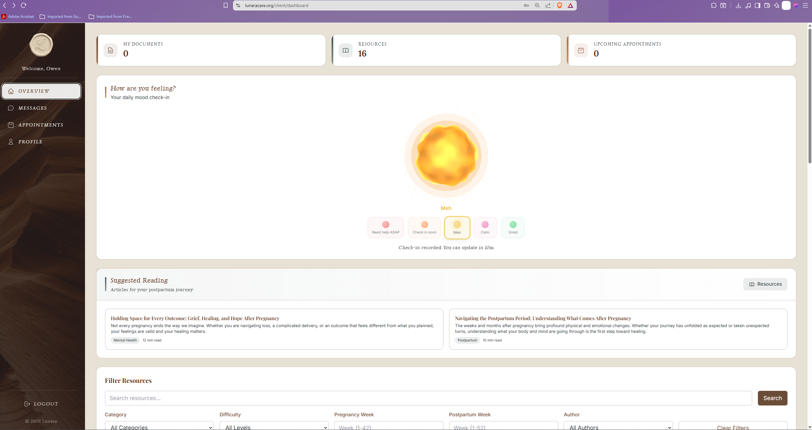
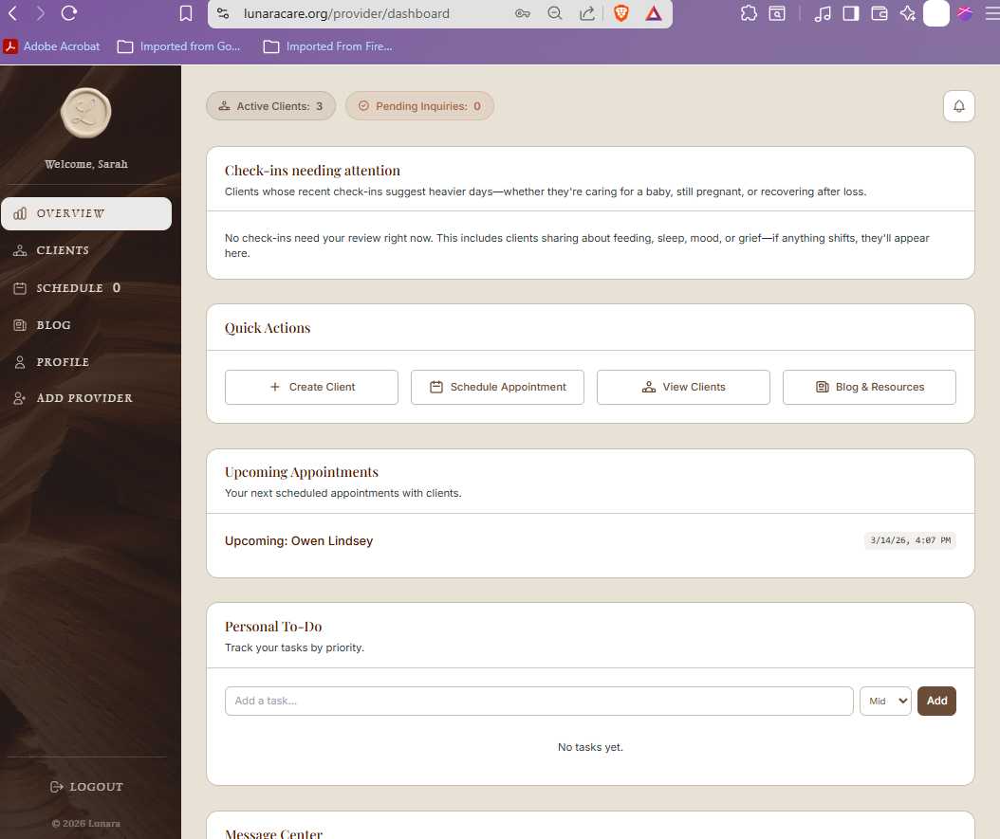
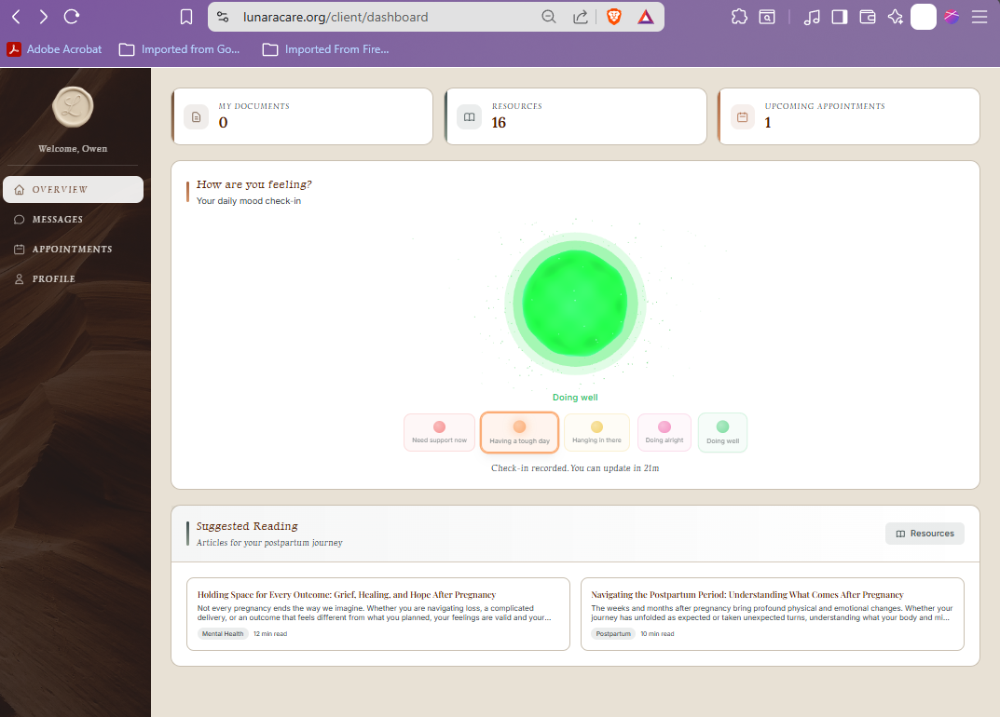
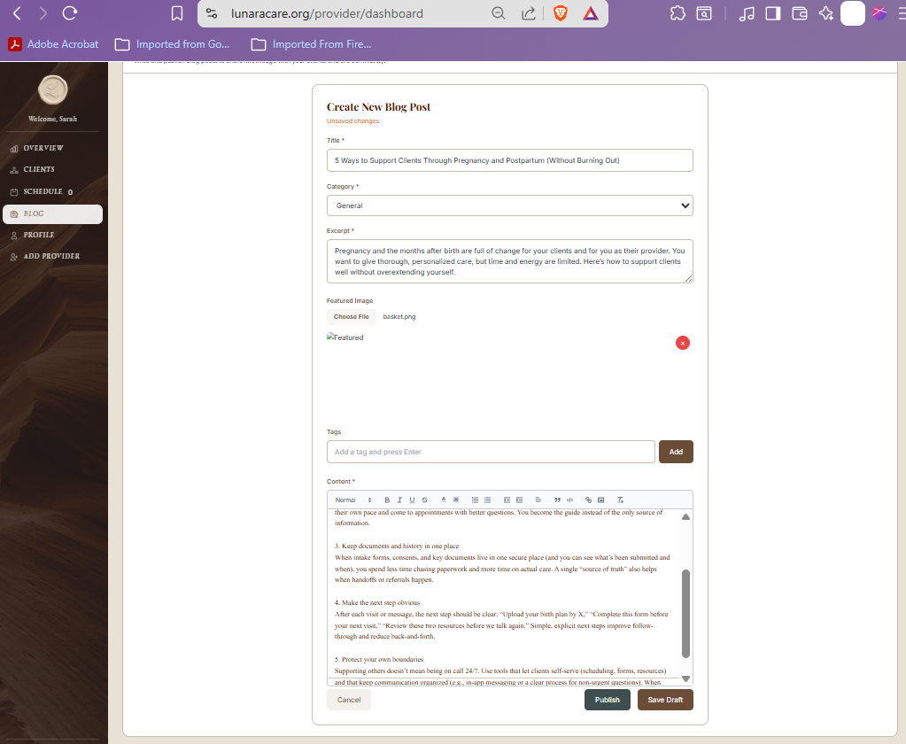
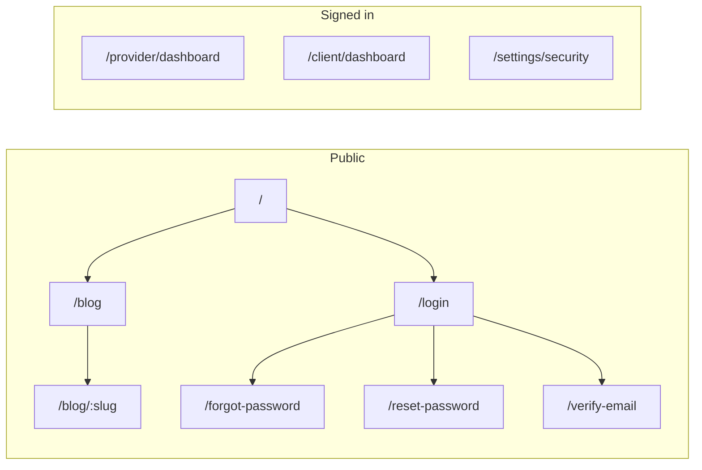

<p align="center">
  
</p>

<h1 align="center">Lunara Frontend</h1>

<p align="center">
  <em>The storybook-inspired interface where clients and providers meet: dashboards, messaging, mood orb, documents, blog, resources, and care plans in one React application.</em>
</p>

<p align="center">
  
  
  
  
  
  
</p>

<p align="center"><sub>Counts from <a href="../Docs/Capstone-Papers/05_milestone_5.pdf">Milestone 5</a> automated results (105 Jest suites, 63.35% statement coverage).</sub></p>

<p align="center">
  <a href="https://www.lunaracare.org">Live site</a> &nbsp;&bull;&nbsp;
  <a href="../README.md">Monorepo overview</a> &nbsp;&bull;&nbsp;
  <a href="../backend/README.md">Backend API</a> &nbsp;&bull;&nbsp;
  <a href="../Docs/DEVELOPMENT_GUIDE.md">Dev guide</a>
</p>

---

## Stack at a glance

<table>
  <tr>
    <td align="center" width="88"><br/><sub>React 18</sub></td>
    <td align="center" width="88"><br/><sub>TypeScript</sub></td>
    <td align="center" width="88"><br/><sub>Vite 6</sub></td>
    <td align="center" width="88"><br/><sub>Tailwind</sub></td>
    <td align="center" width="88"><br/><sub>Three.js R3F</sub></td>
    <td align="center" width="88"><br/><sub>Socket.IO</sub></td>
  </tr>
</table>

**Also in the box:** React Router 6, Axios (refresh interceptors), React Hook Form + Zod, React Quill, React Big Calendar, DOMPurify, Jest + RTL + MSW, Playwright E2E.

---

## What you are looking at

This package is the **entire browser experience** for Lunara: marketing pages, authenticated client and provider workspaces, public blog, security settings, and the service worker hooks for web push. Everything talks to the Express API through a shared Axios client and opens real-time channels through Socket.IO when users message each other. All **140 production source files** (components, pages, services, hooks, contexts, types, and utilities) carry full JSDoc documentation with `@module` headers and `@param`/`@returns` on every export.

<p align="center">
  
  &nbsp;
  
</p>

---

## Feature tour (by surface)

<table>
<tr>
<td width="52%" valign="top">

### Client home

The dashboard pulls together **unread messages**, **document status**, **upcoming appointments**, **resource picks**, **recent blog posts**, and a shortcut into **mood check-in**. Appointments support requesting slots, proposing new times, and following status through confirmation. Documents cover eight clinical and wellness types with privacy tiers and version history.

**Mood** uses a five-step scale rendered as a **3D orb** (React Three Fiber): color and motion reinforce how the user feels without turning the screen into a clinical form.

</td>
<td width="48%" valign="top">

</td>
</tr>
<tr>
<td colspan="2"><hr/></td>
</tr>
<tr>
<td width="48%" valign="top">

</td>
<td width="52%" valign="top">

### Provider home

Providers get a **schedule-first** calendar, **availability slots**, client roster with invite flow, **blog authoring** (auto-save, versions, SEO fields), **resource builder** with attachments and filters, **document review**, **check-in review**, and the same **real-time messaging** rail clients use. Profile and account settings round out the professional footprint.

</td>
</tr>
</table>

### Public and security

| Area | Notes |
|------|--------|
| **Landing** | Hero, services, inquiry capture tied to the public API |
| **Blog** | Listing and slug-based post detail with view tracking |
| **Auth** | Login/register, Google OAuth entry point, email verify, password reset |
| **MFA** | TOTP enrollment on `/settings/security`, challenge during login, tab sync via `localStorage` |
| **Intake** | Five-step wizard (personal, birth, feeding, health, support) with Zod per step |
| **Push** | Permission UX and subscription lifecycle via service worker |

---

## Routing map



---

## Project layout (abbreviated)

```
src/
├── api/apiClient.ts       # Axios singleton, 401 refresh, Render 429 backoff
├── components/            # blog, client, documents, intake, layout, messaging, provider, resources, ui
├── contexts/              # AuthContext, ResourceContext
├── hooks/                 # useAuth, useResource, useSocket
├── pages/                 # 10 route-level screens
├── services/              # 13 API modules + serviceFactory
├── types/                 # models, api, auth, user
└── utils/                 # shared helpers (incl. getBaseApiUrl)
```

---

## Run it locally

**Needs:** Node 18+, running backend (see [backend README](../backend/README.md)).

```bash
cd Lunara
npm install
cp .env.example .env
```

Set the API base to match your backend port (default backend `PORT` is **10000**):

```env
VITE_API_BASE_URL=http://localhost:10000/api
```

If you leave `VITE_API_BASE_URL` empty, the app uses relative `/api` and Vite’s dev proxy (`vite.config.ts` currently forwards `/api` to `http://localhost:5000`). Either align that proxy target with your backend port or use the full URL above.

```bash
npm run dev
```

Open **http://localhost:5173**.

### Scripts

| Command | Purpose |
|---------|---------|
| `npm run dev` | Vite dev server |
| `npm run build` | `tsc` + production bundle |
| `npm run lint` / `lint:fix` | ESLint |
| `npm run format` | Prettier |
| `npm test` / `test:coverage` | Jest |
| `npm run test:e2e` | Playwright |

---

## How the client talks to the API

1. `getBaseApiUrl()` resolves `VITE_API_BASE_URL` or falls back to `/api` for the proxy.
2. Every request sends `Authorization: Bearer …` when a token exists in `localStorage`.
3. Refresh tokens live in **httpOnly** cookies on the API origin; interceptors retry once after refresh on 401.
4. `getSocketUrl()` strips `/api` for Socket.IO when using an absolute API URL.

Production (Vercel) sets `VITE_API_BASE_URL=https://lunara.onrender.com/api` per root `vercel.json`.

---

## License

MIT (see repository root).
