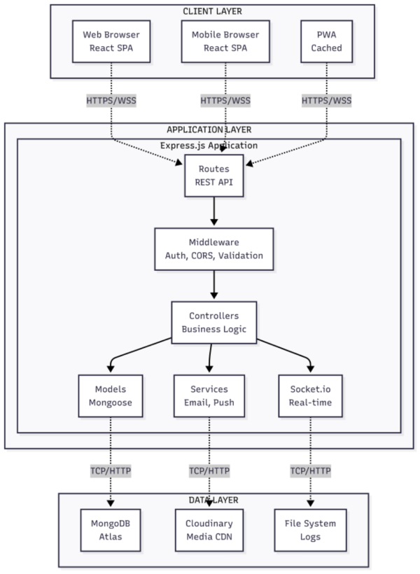
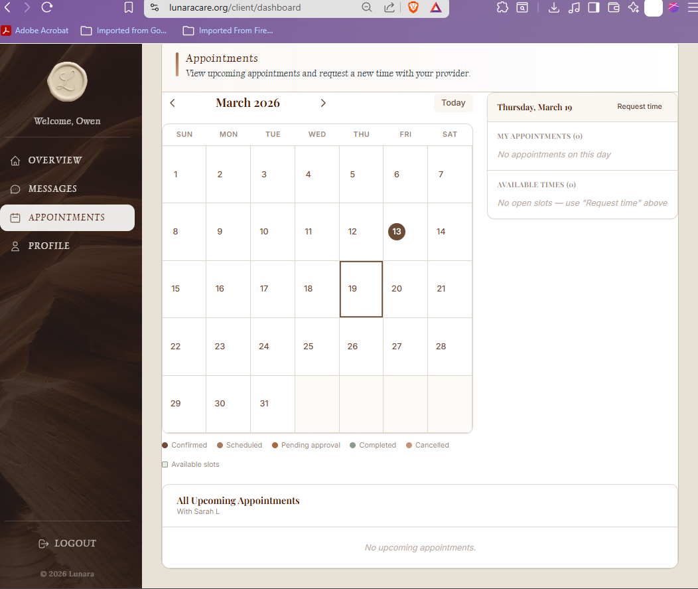
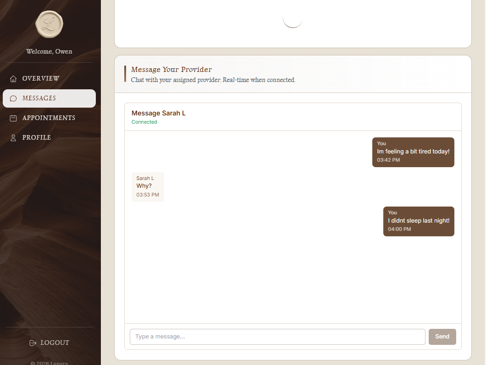
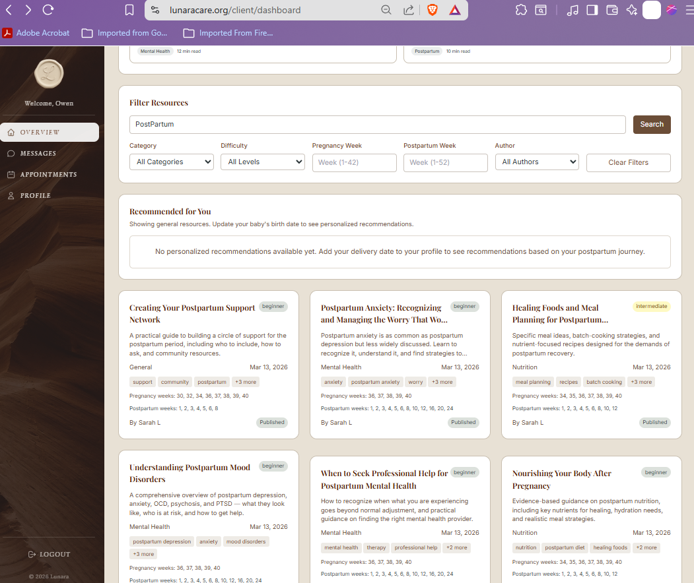
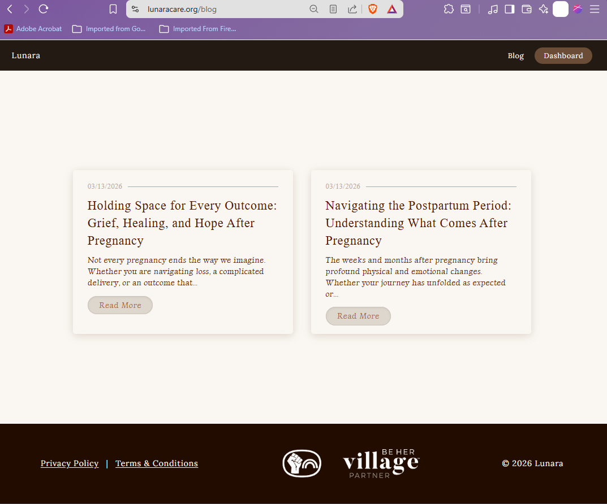
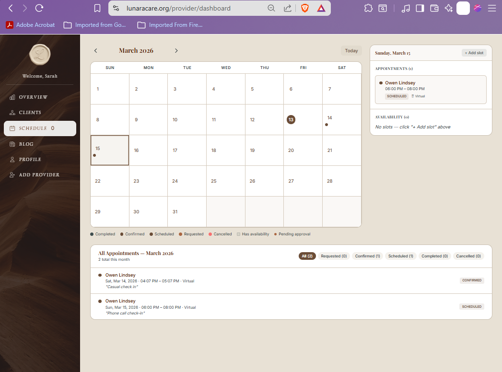
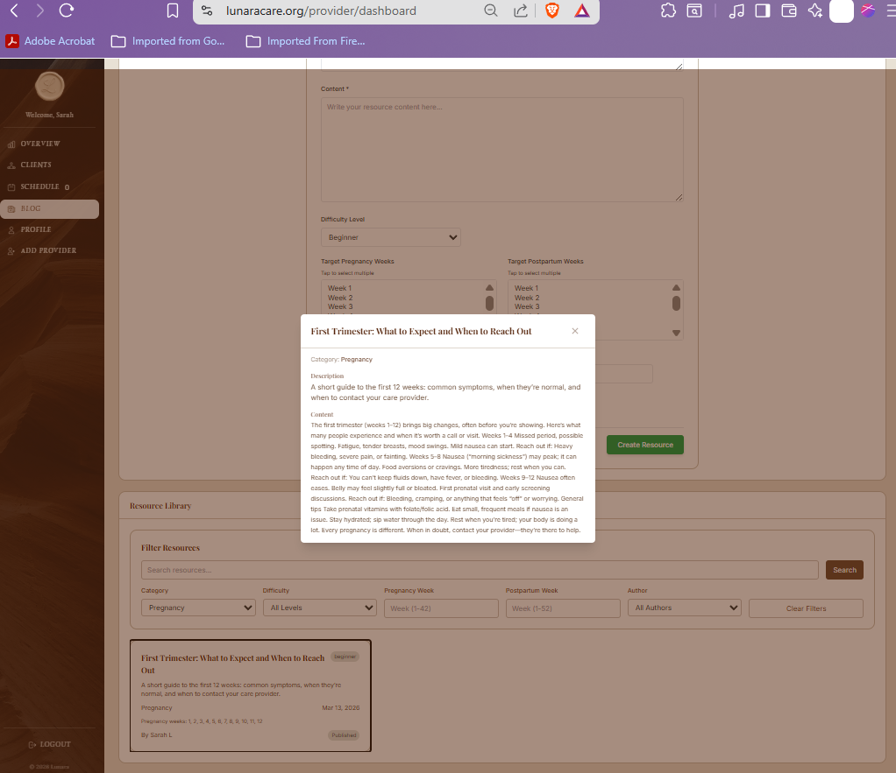

<p align="center">
  
</p>

<h1 align="center">LUNARA</h1>
<h3 align="center">A Postpartum Support Platform</h3>

<p align="center">
  <em>Connecting new mothers with certified doulas and support specialists through a warm, storybook-inspired digital sanctuary.</em>
</p>

<p align="center">
  <a href="https://github.com/omniV1/lunaraCare/actions/workflows/backend-ci.yml">
    
  </a>
  <a href="https://github.com/omniV1/lunaraCare/actions/workflows/frontend-ci.yml">
    
  </a>
  <a href="https://github.com/omniV1/lunaraCare/actions/workflows/build.yml">
    
  </a>
</p>

<p align="center">
  
  
  
  
</p>

<p align="center">
  <a href="https://www.lunaracare.org">Live App</a> &nbsp;&bull;&nbsp;
  <a href="https://lunara.onrender.com/api-docs">API Docs</a> &nbsp;&bull;&nbsp;
  <a href="./Docs/DEVELOPMENT_GUIDE.md">Dev Guide</a> &nbsp;&bull;&nbsp;
  <a href="./Docs/Planning/SPRINT_PLAN.md">Sprint Plan</a>
</p>

---

## What is Lunara?

Lunara is a full-stack web application that bridges the gap between postpartum families and their care providers. Instead of juggling phone calls, paper forms, and disconnected apps, everything lives in one place: scheduling, messaging, mood tracking, document management, educational resources, blog content, and personalized care plans.

The interface is deliberately warm and inviting, drawing from storybook aesthetics and natural imagery to create a space that feels like support rather than software.

<p align="center">
  
</p>

---

## Built With

<table>
  <tr>
    <td align="center" width="96">
      
      <br/><sub>React 18</sub>
    </td>
    <td align="center" width="96">
      
      <br/><sub>TypeScript</sub>
    </td>
    <td align="center" width="96">
      
      <br/><sub>Vite</sub>
    </td>
    <td align="center" width="96">
      
      <br/><sub>Tailwind CSS</sub>
    </td>
    <td align="center" width="96">
      
      <br/><sub>Three.js</sub>
    </td>
    <td align="center" width="96">
      
      <br/><sub>Node.js</sub>
    </td>
  </tr>
  <tr>
    <td align="center" width="96">
      
      <br/><sub>Express</sub>
    </td>
    <td align="center" width="96">
      
      <br/><sub>MongoDB</sub>
    </td>
    <td align="center" width="96">
      
      <br/><sub>Socket.IO</sub>
    </td>
    <td align="center" width="96">
      
      <br/><sub>Docker</sub>
    </td>
    <td align="center" width="96">
      
      <br/><sub>CI/CD</sub>
    </td>
    <td align="center" width="96">
      
      <br/><sub>SonarQube</sub>
    </td>
  </tr>
</table>

Additional tools: Passport.js (JWT, Local, Google OAuth), Nodemailer, Web Push (VAPID), GridFS, React Hook Form + Zod, React Big Calendar, React Quill, DOMPurify, Jest, Playwright, Supertest.

---

## Architecture

<p align="center">
  
</p>

The platform is a monorepo with two main packages. The **React frontend** (hosted on Vercel) communicates with the **Express API** (hosted on Render) over REST and WebSocket connections. MongoDB Atlas provides the data layer with GridFS handling file storage. GitHub Actions runs CI on every push, and SonarQube enforces quality gates.

```
lunaraCare/
├── Lunara/          React 18 frontend (Vite, Tailwind, Three.js)
├── backend/         Express API (MongoDB, Socket.IO, Passport.js)
├── Docs/            Architecture docs, capstone papers, diagrams
├── .github/         CI/CD workflows (backend, frontend, SonarQube)
├── scripts/         Monorepo coverage tooling
├── docker-compose.yml
├── render.yaml      Backend deployment blueprint
└── vercel.json      Frontend deployment config
```

---

## Features at a Glance

### For Clients (Mothers)

<table>
<tr>
<td width="50%">

**Dashboard**

A personal landing pad with unread messages, upcoming visits, recent blog posts, care-plan snapshots, and quick actions so nothing important sits out of sight.

</td>
<td width="50%">

</td>
</tr>
<tr>
<td width="50%">

</td>
<td width="50%">

**Appointments**

Request sessions from a provider's availability, propose alternative times when life gets in the way, and follow each visit from request through confirmation on the calendar.

</td>
</tr>
<tr>
<td width="50%">

</td>
<td width="50%">

**Real-Time Messaging**

Secure, instant communication with an assigned provider through Socket.IO. Messages sync across tabs, show read receipts, and support text, image, and file types. Unread counts surface on the dashboard so nothing gets missed.

</td>
</tr>
<tr>
<td width="50%">

**Mood and Wellness Tracking**

A gentle five-level check-in tied to a 3D animated orb built with Three.js. The orb shifts color from warm red to calm green as mood improves. Physical symptoms across 10 categories are tracked alongside mood, and trends surface alerts if patterns suggest a client needs extra support.

</td>
<td width="50%">

</td>
</tr>
<tr>
<td width="50%">

**Resource library**

Browse educational articles filtered by postpartum week, difficulty, and category, open detail views, and track what is most relevant to where you are in recovery.

</td>
<td width="50%">

</td>
</tr>
<tr>
<td width="50%">

</td>
<td width="50%">

**Blog and documents**

Read provider-written blog posts on your own time. Upload structured forms and logs (health assessments, feeding and sleep logs, recovery notes) for review, with privacy levels, version history, and a clear submitted-to-provider workflow.

</td>
</tr>
</table>

### For Providers (Doulas)

<table>
<tr>
<td width="50%">

**Practice overview**

A command center for client counts, pending work, and recent activity. Jump off to clients, messages, check-ins, care plans, and the schedule without losing context.

</td>
<td width="50%">

</td>
</tr>
<tr>
<td width="50%">

</td>
<td width="50%">

**Scheduling and availability**

Define availability slots, see the calendar at a glance, book or adjust visits (virtual or in-person), and walk clients through request, confirmation, and reschedule flows from the same workspace.

</td>
</tr>
<tr>
<td width="50%">

**Blog authoring**

Rich text posts with auto-save, draft and publish controls, version history, SEO fields (slug, excerpt, tags, categories), and featured imagery so public content stays accurate and discoverable.

</td>
<td width="50%">

</td>
</tr>
<tr>
<td width="50%">

</td>
<td width="50%">

**Educational resources**

Create and curate library items aimed at specific postpartum weeks and difficulty levels, attach files, and manage what appears in each client’s resource feed alongside blog content.

</td>
</tr>
</table>

### Platform-Wide

| Capability | How It Works |
|---|---|
| **Authentication** | JWT access/refresh tokens, Google OAuth, email verification, password reset |
| **Two-Factor Auth** | TOTP-based MFA with QR enrollment and 8 backup codes |
| **Care Plans** | Template-based or custom plans with milestones by category (physical, emotional, feeding, self-care) |
| **Client Onboarding** | Five-step intake wizard collecting birth, feeding, health, and support data |
| **Push Notifications** | Browser notifications via Web Push API with per-device subscription management |
| **Document Review** | Submission workflow from draft through provider review to completion with privacy tiers |
| **Recommendations** | Personalized resource suggestions based on postpartum week and interaction history |
| **Admin Tools** | Provider account creation, platform statistics, content seeding, user management |

---

## Quick Start

> Requires **Node.js 18+** and a **MongoDB** instance (local or Atlas).

```bash
# Clone
git clone https://github.com/omniV1/lunaraCare.git
cd lunaraCare

# Backend
cd backend
cp .env.example .env        # fill in MongoDB URI, JWT secrets, email creds
npm install
npm run dev                  # runs on http://localhost:10000

# Frontend (new terminal)
cd Lunara
cp .env.example .env         # set VITE_API_BASE_URL=http://localhost:10000/api
npm install
npm run dev                  # runs on http://localhost:5173
```

Or spin up everything with Docker:

```bash
docker-compose up --build -d
# Backend :10000  |  Frontend :5173  |  MongoDB :27017  |  SonarQube :9000
```

See the [backend README](./backend/README.md) and [frontend README](./Lunara/README.md) for full environment variable references and available scripts.

---

## Quality and Testing

<p align="center">
  
  
  
  
</p>

Figures match [Milestone 5 (Testing)](./Docs/Capstone-Papers/05_milestone_5.tex) automated test execution results: **118 Jest suites**, **1044 tests** (891 frontend, 153 backend), all passing, plus **32** Playwright E2E tests. Jest **statement** coverage is **90.58%** on the backend and **63.35%** on the frontend.

| Layer | Tests | Tools |
|---|---|---|
| Frontend (Jest) | 891 (105 suites) | Jest, React Testing Library, MSW |
| Frontend (E2E) | 32 | Playwright |
| Backend (Jest) | 153 (13 suites) | Jest, Supertest, mongodb-memory-server |
| Static Analysis | SonarQube | Security, reliability, maintainability all A-rated |

Pre-commit hooks via Husky enforce TypeScript type-checking, ESLint (zero warnings), and Prettier formatting on every staged file. GitHub Actions runs the full test and build pipeline on every push.

---

## Deployment

| Service | Host | URL |
|---|---|---|
| Frontend | Vercel | [lunaracare.org](https://www.lunaracare.org) |
| Backend API | Render | [lunara.onrender.com/api](https://lunara.onrender.com/api) |
| API Docs | Render | [lunara.onrender.com/api-docs](https://lunara.onrender.com/api-docs) |
| Database | MongoDB Atlas | Managed cluster |

---

## Documentation

| Document | What It Covers |
|---|---|
| [Backend README](./backend/README.md) | API endpoints, data models, authentication, Socket.IO events, setup |
| [Frontend README](./Lunara/README.md) | Components, pages, services, routing, build config |
| [Docs README](./Docs/README.md) | Documentation index and capstone paper inventory |
| [Development Guide](./Docs/DEVELOPMENT_GUIDE.md) | Full architecture reference and troubleshooting |
| [Sprint Plan](./Docs/Planning/SPRINT_PLAN.md) | 10-week roadmap, task breakdown, quality metrics |
| [Render Deploy Guide](./Docs/RENDER_DEPLOY.md) | Production deployment troubleshooting |

---

## Team

<p align="center">
  <em>Senior capstone project at Grand Canyon University, advised by Professor Amr Elchouemi.</em>
</p>

<table align="center">
  <tr>
    <td align="center">
      <strong>Owen Lindsey</strong><br/>
      <sub>Full Stack Developer</sub>
    </td>
    <td align="center">
      <strong>Carter Wright</strong><br/>
      <sub>Full Stack Developer</sub>
    </td>
    <td align="center">
      <strong>Andrew Mack</strong><br/>
      <sub>Full Stack Developer</sub>
    </td>
  </tr>
</table>

---

## Contributing

Follow existing TypeScript conventions. Add tests for new features. Update Swagger comments for new endpoints. Ensure the test suite passes and the SonarQube quality gate clears before opening a PR. Use conventional commit messages.

## License

MIT License. See [LICENSE](./LICENSE) for details.
