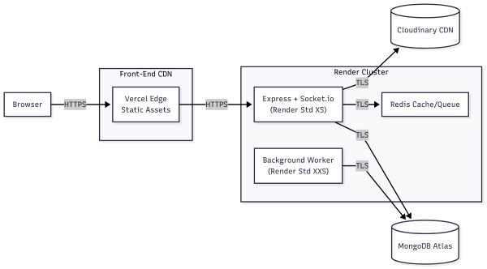
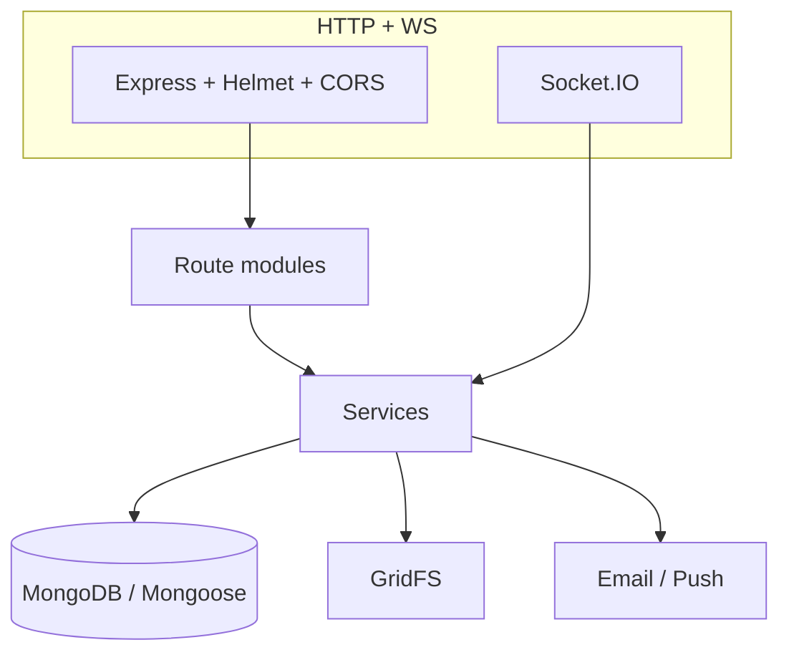

<p align="center">
  
  &nbsp;&nbsp;
  
  &nbsp;&nbsp;
  
</p>

<h1 align="center">Lunara Backend API</h1>

<p align="center">
  <em>Express + TypeScript service layer for Lunara: REST, Socket.IO chat, JWT and MFA, GridFS files, email, and web push. Hosted on Render; documented with Swagger.</em>
</p>

<p align="center">
  <a href="https://github.com/omniV1/lunaraCare/actions/workflows/backend-ci.yml"></a>
  &nbsp;
  
  
  
  
</p>

<p align="center"><sub>Monorepo Jest total: <strong>1044</strong> tests (891 frontend + 153 backend) per <a href="../Docs/Capstone-Papers/05_milestone_5.tex">Milestone 5</a>.</sub></p>

<p align="center">
  <a href="https://lunara.onrender.com/api-docs">Live Swagger</a> &nbsp;&bull;&nbsp;
  <a href="../README.md">Monorepo</a> &nbsp;&bull;&nbsp;
  <a href="../Lunara/README.md">Frontend</a> &nbsp;&bull;&nbsp;
  <a href="../Docs/DEVELOPMENT_GUIDE.md">Dev guide</a>
</p>

---

## Inside the server

This is not a thin CRUD wrapper. **20 route modules** delegate to **30 services** that implement scheduling rules, document workflows, blog and resource versioning, check-in trend analysis, appointment reminders, rate-limited messaging, and admin operations. **19 Mongoose models** map to MongoDB; binaries land in **GridFS**. Real-time paths run beside REST on the same process via **Socket.IO**.

<p align="center">
  
</p>



| Layer | What lives here |
|-------|------------------|
| **Routes** | Auth, MFA, users, providers, clients, appointments, messages, check-ins, care plans, blog, resources, documents, files, categories, intake, recommendations, interactions, push, admin, public |
| **Services** | Business rules, notifications, caching, GridFS, validation orchestration |
| **Data** | Users, clients, providers, appointments, slots, messages, check-ins, care plans, blog, resources, documents, categories, interactions, push subscriptions, inquiries |

**Interactive docs:** run the server and open `/api-docs` (Swagger UI). The tables below mirror that surface for quick offline reference.

---

## Authentication and security (summary)

| Mechanism | Behavior |
|-----------|-----------|
| **Access JWT** | Short-lived bearer token for API calls |
| **Refresh token** | httpOnly cookie, rolling sessions (max 5 per user) |
| **MFA** | TOTP + QR setup + backup codes (`otpauth`) |
| **Account lock** | After repeated failed logins (see `authService`) |
| **Transport** | Helmet, CORS allowlist, express-validator, sanitized strings |
| **Messaging** | JWT on socket handshake; client/provider pairing enforced; per-user rate limit |

---

## Real-time messaging (Socket.IO)

| Direction | Event | Role |
|-----------|-------|------|
| Client → server | `join_user_room` | Personal notification channel |
| Client → server | `join_conversation` | Conversation room |
| Client → server | `send_message` | Persisted message |
| Server → client | `new_message` | Broadcast to conversation |
| Server → client | `new_message_notification` | Receiver alert |
| Server → client | `message_delivered` | Ack to sender |
| Server → client | `message_error`, `auth_error`, `rate_limit` | Failure paths |

Typical cap: **30 messages / 10 seconds** per user (see `messageRateLimiter`).

---

<details>
<summary><strong>Full REST reference</strong> (20 modules, all paths under <code>/api</code> unless noted)</summary>

### Authentication (`/api/auth`)

| Method | Path | Description |
|--------|------|-------------|
| POST | `/register` | Register a new client or provider |
| POST | `/login` | Email/password login |
| POST | `/google` | Initiate Google OAuth |
| GET | `/google/callback` | Google OAuth callback |
| POST | `/refresh` | Refresh access token |
| POST | `/logout` | Invalidate refresh token |
| POST | `/verify-email` | Verify email with token |
| POST | `/forgot-password` | Request password reset email |
| POST | `/reset-password` | Complete password reset |
| GET | `/check-email` | Check if email is already registered |
| POST | `/resend-verification` | Resend verification email |
| POST | `/me` | Get current authenticated user |
| GET | `/session` | Get session info |

### Multi-Factor Authentication (`/api/auth/mfa`)

| Method | Path | Description |
|--------|------|-------------|
| POST | `/setup` | Generate TOTP secret and QR code |
| POST | `/confirm-setup` | Confirm MFA with 6-digit code |
| POST | `/disable` | Disable MFA |
| POST | `/verify` | Verify TOTP code during login |
| GET | `/backup-codes` | Retrieve backup codes |

### Users (`/api/users`)

| Method | Path | Description |
|--------|------|-------------|
| GET | `/profile` | Get current user profile |
| PUT | `/profile` | Update current user profile |
| GET | `/all` | List all users (admin) |
| GET | `/search` | Search users |
| GET | `/:id` | Get user by ID |
| PUT | `/:id` | Update user (admin) |
| DELETE | `/:id` | Delete user (admin) |
| POST | `/:id/lock` | Lock/unlock account (admin) |

### Providers (`/api/providers`)

| Method | Path | Description |
|--------|------|-------------|
| GET | `/me` | Get current provider profile |
| PUT | `/me` | Update provider profile |
| GET | `/all` | List all providers |
| GET | `/available` | Get providers with open availability |
| GET | `/search` | Search providers |
| GET | `/stats` | Provider statistics |
| GET | `/:id` | Get provider details |
| PUT | `/:id` | Update provider (admin) |
| DELETE | `/:id` | Delete provider (admin) |
| PUT | `/:id/availability` | Update availability |
| POST | `/:id/rating` | Rate a provider |
| POST | `/:id/verify` | Verify provider (admin) |

### Clients (`/api/client`)

| Method | Path | Description |
|--------|------|-------------|
| GET | `/me` | Get current client profile |
| PUT | `/me` | Update client profile |
| GET | `/stats` | Client statistics |
| GET | `/assigned-provider` | Get assigned provider info |
| GET | `/:id` | Get client details |
| PUT | `/:id` | Update client (admin) |
| GET | `/:id/history` | Get client history |
| POST | `/:id/assign-provider` | Assign provider to client |

### Appointments (`/api/appointments`)

| Method | Path | Description |
|--------|------|-------------|
| GET | `/` | List appointments for current user |
| POST | `/` | Create appointment |
| GET | `/upcoming` | Get upcoming appointments |
| GET | `/calendar` | Calendar view |
| GET | `/availability` | Get provider availability |
| GET | `/:id` | Get appointment details |
| PUT | `/:id` | Update appointment |
| DELETE | `/:id` | Delete appointment |
| POST | `/:id/request` | Client requests appointment |
| POST | `/:id/propose` | Propose alternative time |
| POST | `/:id/confirm` | Confirm appointment |
| POST | `/:id/cancel` | Cancel appointment |
| POST | `/availability/create` | Create availability slot |
| DELETE | `/availability/:id` | Delete availability slot |
| POST | `/bulk` | Bulk create appointments |
| GET | `/provider/:id` | Get provider's appointments |
| GET | `/client/:id` | Get client's appointments |

### Messages (`/api/messages`)

| Method | Path | Description |
|--------|------|-------------|
| GET | `/` | List conversations |
| POST | `/` | Send a message |
| GET | `/all` | Get all messages (paginated) |
| GET | `/unread` | Get unread messages |
| GET | `/unread/count` | Get unread count |
| GET | `/conversation/:id` | Get conversation messages |
| PUT | `/:id/read` | Mark message as read |
| DELETE | `/:id` | Delete message |

### Check-ins (`/api/checkins`)

| Method | Path | Description |
|--------|------|-------------|
| POST | `/` | Submit a check-in |
| GET | `/` | Get user's check-ins |
| GET | `/trends` | Get mood/symptom trends |
| GET | `/alerts` | Get alerts for concerning patterns |
| GET | `/:id` | Get specific check-in |
| PUT | `/:id` | Update check-in |
| DELETE | `/:id` | Delete check-in |
| GET | `/provider/:id` | Provider views client check-ins |

### Care Plans (`/api/care-plans`)

| Method | Path | Description |
|--------|------|-------------|
| GET | `/templates` | List care plan templates |
| POST | `/templates` | Create template (provider) |
| POST | `/` | Create care plan |
| GET | `/:id` | Get care plan details |
| PUT | `/:id` | Update care plan |
| DELETE | `/:id` | Delete care plan |
| GET | `/:id/milestones` | Get milestones |
| PUT | `/:id/milestones/:milestoneId` | Update milestone status |
| PUT | `/:id/progress` | Update progress |
| POST | `/:id/complete` | Mark as complete |
| GET | `/client/:id` | Get client's care plans |
| GET | `/provider/:id` | Get provider's care plans |

### Blog (`/api/blog`)

| Method | Path | Description |
|--------|------|-------------|
| GET | `/` | List published blog posts |
| POST | `/` | Create blog post (provider) |
| GET | `/search` | Search blog posts |
| GET | `/slug/:slug` | Get post by slug |
| GET | `/:id` | Get post by ID |
| PUT | `/:id` | Update blog post |
| DELETE | `/:id` | Delete blog post |
| GET | `/:id/versions` | Get version history |
| POST | `/:id/restore` | Restore previous version |
| POST | `/:id/publish` | Publish post |
| POST | `/:id/unpublish` | Unpublish post |

### Resources (`/api/resources`)

| Method | Path | Description |
|--------|------|-------------|
| GET | `/` | List resources (filterable) |
| POST | `/` | Create resource (provider/admin) |
| GET | `/search` | Search resources |
| GET | `/category/:categoryId` | Get resources by category |
| GET | `/:id` | Get resource details |
| PUT | `/:id` | Update resource |
| DELETE | `/:id` | Delete resource |
| GET | `/:id/versions` | Get version history |
| POST | `/:id/restore` | Restore previous version |
| POST | `/:id/publish` | Publish resource |
| POST | `/:id/unpublish` | Unpublish resource |

### Documents (`/api/documents`)

| Method | Path | Description |
|--------|------|-------------|
| GET | `/` | List user's documents |
| POST | `/` | Upload/create document |
| GET | `/:id` | Get document details |
| PUT | `/:id` | Update document |
| DELETE | `/:id` | Delete document |
| POST | `/:id/submit` | Submit to provider |
| POST | `/:id/review` | Provider review with feedback |
| GET | `/:id/versions` | Get version history |
| POST | `/:id/restore` | Restore previous version |
| GET | `/provider/:id` | Provider view of client documents |

### Files (`/api/files`)

| Method | Path | Description |
|--------|------|-------------|
| POST | `/upload` | Upload file to GridFS |
| GET | `/:id` | Download file |
| DELETE | `/:id` | Delete file |
| GET | `/:id/info` | Get file metadata |

### Categories (`/api/categories`)

| Method | Path | Description |
|--------|------|-------------|
| GET | `/` | List all categories |
| POST | `/` | Create category (admin) |
| GET | `/search` | Search categories |
| GET | `/:id` | Get category details |
| PUT | `/:id` | Update category |
| DELETE | `/:id` | Delete category |
| GET | `/:id/tree` | Get full category tree |
| GET | `/:id/children` | Get subcategories |

### Intake (`/api/intake`)

| Method | Path | Description |
|--------|------|-------------|
| GET | `/me` | Get current user's intake |
| POST | `/` | Create or update intake |
| GET | `/:id` | Get intake by ID |
| PUT | `/:id` | Update intake |

### Recommendations (`/api/recommendations`)

| Method | Path | Description |
|--------|------|-------------|
| GET | `/resources` | Get personalized resource suggestions |
| GET | `/checkin-insights` | Get check-in trend insights |

### Interactions (`/api/interactions`)

| Method | Path | Description |
|--------|------|-------------|
| POST | `/view` | Track resource view |
| POST | `/like` | Like resource |
| POST | `/bookmark` | Bookmark resource |
| GET | `/history` | Get interaction history |

### Push Notifications (`/api/push`)

| Method | Path | Description |
|--------|------|-------------|
| GET | `/vapid-public-key` | Get VAPID public key |
| POST | `/subscribe` | Subscribe to push notifications |
| POST | `/unsubscribe` | Unsubscribe |
| POST | `/send-test` | Send test notification |
| GET | `/subscriptions` | Get user's subscriptions |

### Admin (`/api/admin`)

| Method | Path | Description |
|--------|------|-------------|
| POST | `/providers` | Create provider account |
| GET | `/stats` | Platform statistics |
| GET | `/analytics` | Analytics data |
| POST | `/content/seed` | Seed default content |

### Public (`/api/public`)

| Method | Path | Description |
|--------|------|-------------|
| GET | `/info` | Platform information (no auth) |
| GET | `/contact` | Contact information |
| POST | `/inquiries` | Submit contact form |
| GET | `/resources` | Public resources |
| GET | `/blog` | Public blog posts |

### Health

| Method | Path | Description |
|--------|------|-------------|
| GET | `/api/health` | Health check |

</details>

<details>
<summary><strong>Data model cheat sheet</strong></summary>

| Model | Purpose |
|-------|---------|
| **User** | Base identity: name, email, hashed password, role, MFA fields, lockout, refresh token slots |
| **Client** | Postpartum profile, intake fields, assigned provider |
| **Provider** | Credentials, specialties, availability, ratings, client roster |
| **Appointment** | Client/provider, window, status workflow, type (virtual / in-person) |
| **AvailabilitySlot** | Bookable provider time blocks |
| **Message** | Conversation-scoped chat payload and read state |
| **CheckIn** | Mood score, symptom flags, provider visibility |
| **CarePlan** / **CarePlanTemplate** | Milestones by category and week offset |
| **BlogPost** / **BlogPostVersion** | Rich article content, publishing, history |
| **Resources** / **ResourceVersion** | Educational items, difficulty, target weeks, attachments |
| **ClientDocument** / **ClientDocumentVersion** | Typed uploads, workflow, privacy |
| **Category** | Tree for blog and resources |
| **UserResourceInteraction** | Views, likes, bookmarks |
| **PushSubscription** | Web push endpoints and keys |
| **Inquiry** | Public contact form pipeline |

</details>

---

## Repository layout (abbreviated)

```
backend/src/
├── config/passport.ts
├── middleware/          # auth, cache, errors, validation helpers
├── models/              # 19 Mongoose schemas
├── routes/              # 20 routers
├── services/            # 30 domain services
├── seeds/seedContent.ts
├── types/, utils/
└── server.ts
```

Utility scripts live in `backend/scripts/` (admin user, care plan templates, test users, email verification).

---

## Run it locally

**Needs:** Node 18+, MongoDB (local or Atlas), SMTP credentials for mail flows.

```bash
cd backend
npm install
cp .env.example .env
```

Minimal `.env` sketch:

```env
NODE_ENV=development
PORT=10000
MONGODB_URI=mongodb://localhost:27017/lunara
JWT_SECRET=your-jwt-secret
JWT_REFRESH_SECRET=your-refresh-secret
EMAIL_USER=your-email@gmail.com
EMAIL_PASS=your-app-password
FRONTEND_URL=http://localhost:5173
SKIP_EMAIL_VERIFICATION=true
```

Optional: `GOOGLE_*`, `VAPID_*`, `CLOUDINARY_URL`, `CORS_ALLOWED_ORIGINS`, `RATE_LIMIT_DISABLED`, `LOG_LEVEL`.

```bash
npm run dev
```

- Swagger: **http://localhost:10000/api-docs**
- Health: **http://localhost:10000/api/health**

### NPM scripts

`npm run dev` · `npm run build` · `npm start` · `npm test` · `npm run test:coverage` · `npm run create:admin` · `npm run seed:care-plan-templates` · `npm run seed:test-users` · `npm run email:verify` · lint/format/type-check variants as in `package.json`.

---

## Seed data

On startup, empty databases receive default **categories**, **blog posts**, and **resources** via `seedContent.ts`. Use scripts above for care plan templates and disposable test accounts.

---

## Deployment (Render)

Root `render.yaml` defines the web service: install with devDependencies for the TypeScript build, run `npm run build`, start with `npm start` (`node dist/server.js`), health check `/api/health`. Set production secrets in the Render dashboard (JWT pair, Mongo URI, email, VAPID, OAuth).

**Production checklist:** strong secrets, Atlas IP allowlist, `SKIP_EMAIL_VERIFICATION=false`, CORS aligned with Vercel, real Gmail app passwords.

---

## License

MIT (see repository root).
